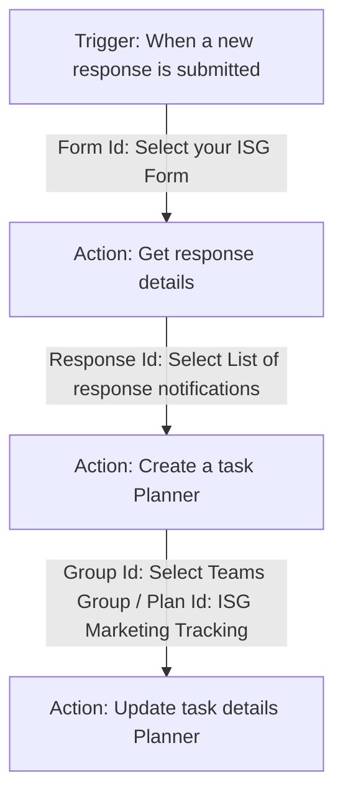

# 📋 Microsoft Forms & Planner Marketing Intake Setup Guide

Since Microsoft Forms and Microsoft Planner are cloud-based applications inside the UIUC Office 365 enterprise environment, they require authentication and must be created through your student portal. 

This guide provides the exact fields, buckets, and Power Automate flow configurations to link them together so that **whenever a legislative member submits the Microsoft Form, a tracking card is automatically created on your Microsoft Planner board.**

---

## 1. Create the Microsoft Form
1. Go to **[forms.office.com](https://forms.office.com)** and log in with your UIUC credentials.
2. Click **New Form** and title it: **ISG Legislative Marketing Request Form**.
3. Add the following questions:

| # | Question Title | Type | Description / Options |
| :---: | :--- | :---: | :--- |
| **1** | **Event Name** | Text | *Short answer (Required)* |
| **2** | **Event Date & Time** | Date | *Required* |
| **3** | **Required Completion Date** | Date | *Required (Include note: "Please allow a minimum 2-week lead time")* |
| **4** | **Contact Name** | Text | *Short answer (Required)* |
| **5** | **Contact Email** | Text | *Short answer (Required)* |
| **6** | **Marketing Channels Needed** | Choices | *Checkboxes (Multiple answers):*<br>- Instagram Post<br>- Instagram Story<br>- Flyer / Poster<br>- Digital Signage<br>- Video Reel / TikTok |
| **7** | **Details & Copy Text** | Text | *Long answer (Optional): Provide taglines, descriptions, or specific text to include.* |
| **8** | **Assets Folder Link** | Text | *Short answer (Optional): Box or Google Drive URL for images/copy.* |

---

## 2. Set Up the Microsoft Planner Board
1. In your **Microsoft Teams** channel or via **[tasks.office.com](https://tasks.office.com)**, create a new Plan called **ISG Marketing Tracking**.
2. Rename/create the following **Buckets** (columns) to match your workflow:
   *   **Queue (New)**
   *   **In Design (Drafting)**
   *   **Under Review (Approval)**
   *   **Completed / Posted**

---

## 3. Link Form to Planner via Power Automate (The Automation)
This automation links the two systems together.

1. Go to **[make.powerautomate.com](https://make.powerautomate.com)** and log in.
2. Click **Create** ➔ **Automated cloud flow**.
3. Name your flow: **ISG Marketing Form to Planner Card**.
4. Choose the trigger: **When a new response is submitted (Microsoft Forms)**. Click **Create**.
5. Configure the Flow steps exactly as follows:



### Detailed Flow Steps Configuration:

#### Step 1: Trigger — *When a new response is submitted*
*   **Form Id**: Select **ISG Legislative Marketing Request Form** from the dropdown.

#### Step 2: Action — *Get response details*
*   Click **New Step** and search for **Get response details (Microsoft Forms)**.
*   **Form Id**: Select **ISG Legislative Marketing Request Form**.
*   **Response Id**: Click the field and select **Response Id** from the Dynamic Content popup.

#### Step 3: Action — *Create a task (Planner)*
*   Click **New Step** and search for **Create a task (Planner)**.
*   **Group Id**: Select your ISG Teams group.
*   **Plan Id**: Select **ISG Marketing Tracking**.
*   **Title**: Click the field and select **Event Name** (from Step 2 Dynamic Content) followed by `" - Marketing Request"`.
*   **Bucket Id**: Select **Queue (New)**.
*   **Start Date**: Select **Expression** and type `utcNow()`.
*   **Due Date**: Select **Required Completion Date** (from Step 2 Dynamic Content).

#### Step 4: Action — *Update task details (Planner)*
*   Click **New Step** and search for **Update task details (Planner)**.
*   **Task Id**: Click the field and select **ID** (the task ID returned from Step 3).
*   **Description**: Click the field and paste the following template, inserting the Dynamic Content from Step 2:
    ```text
    Requested By: [Contact Name] ([Contact Email])
    Event Date: [Event Date & Time]
    Channels: [Marketing Channels Needed]
    
    Details: 
    [Details & Copy Text]
    
    Assets Box Link: [Assets Folder Link]
    ```
5. Click **Save** and test the flow by submitting a mock form!
